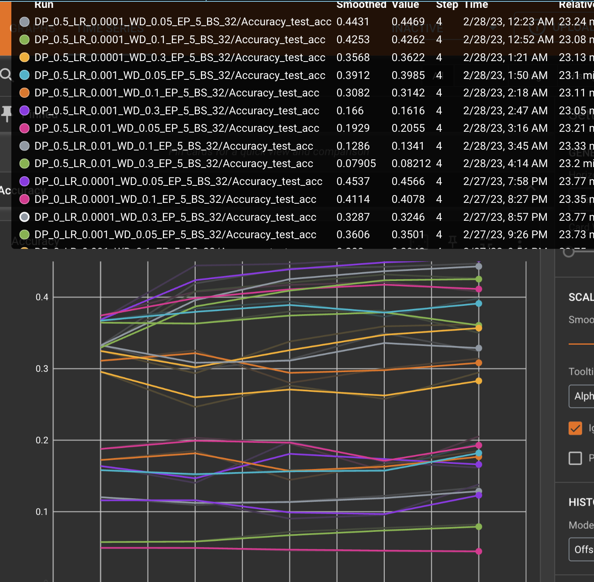
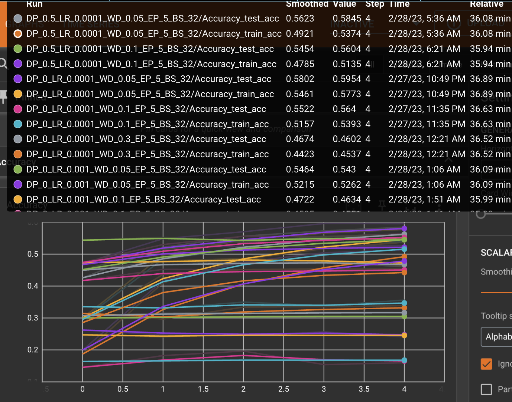
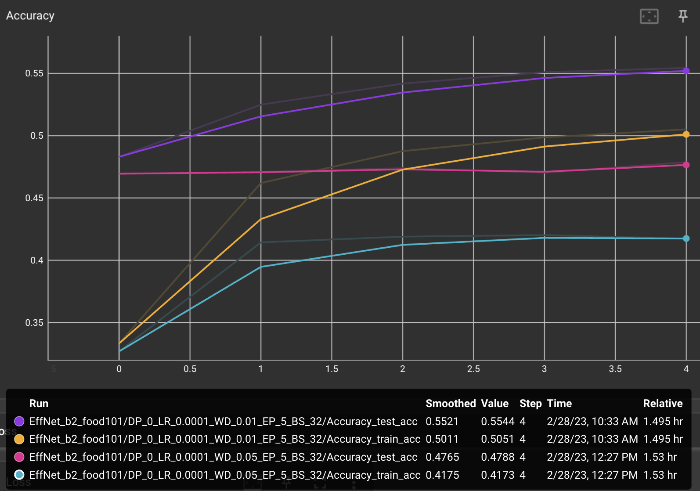
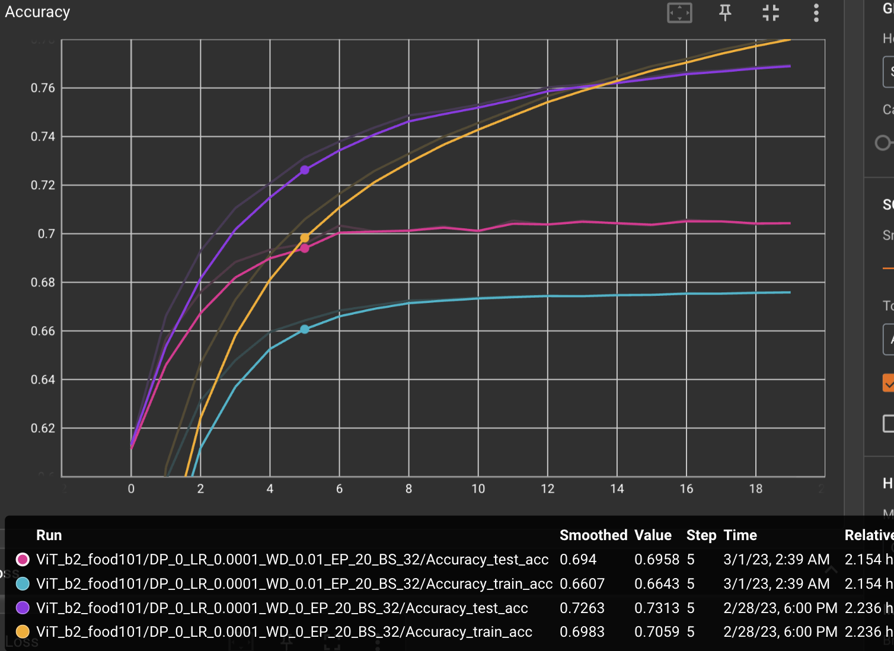
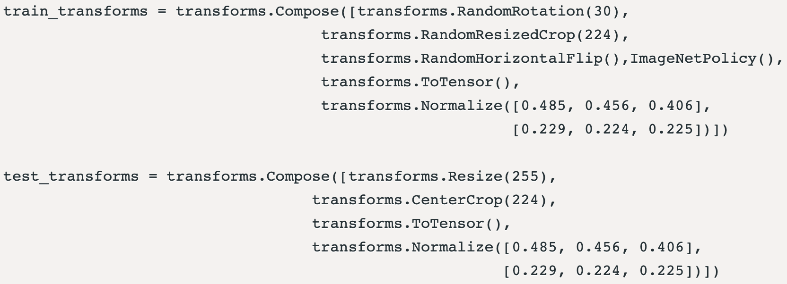
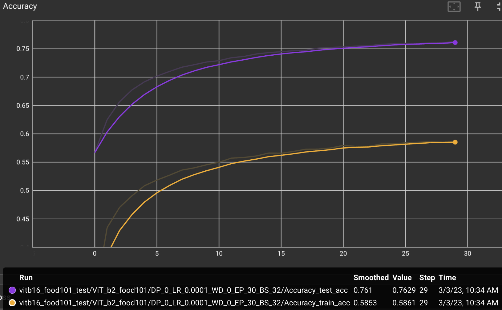

# Experimenting with models and datasets used for paper replicating practices

## 1. Food101 dataset
  First, hyper-parameter tuning using EfficientNet and ViT has been conducted.
  with 5 epoches, poor accuracy even under 50% (Effnet) is confirmed.

  |EfficientNet|ViT|
  |:--:|:--:|
  |||
  |'Value' represents accuracy after 5-epochs training, with maximum of about 46%|'Value' represents accuracy after 5-epochs training, with maximum of about 58%|

  The next approach was to set 'weight decay' to lower value. Both EfficientNet and ViT shows increased accuracy by lowering WD value to 0.01 or 0. Dropout probability was set to 0, and the 20-epochs training in ViT model shows higher training set accuracy even the testing set accuracy was always higher before, which implies over-fitting began. The accuracy itself was increased at most 83%(train), 77%(test) with 50-epochs trial.

  |EfficientNet|ViT|
  |:--:|:--:|
  |||
  |Accuracy maximum of about 55% after 5-epochs|Accuracy maximum of about 73% after 5-epochs, and about 77% after 20-epochs|

  The following approach was to reduce overfitting and increase maximum accuracy even if more iteration is required.  
  The previous training was conducted dataset with transforms of basic ViT pytorch model. The newer transforms was taken from [Dense-161](https://devpost.com/software/food101-classification#updates) research. It shows slower increasement of testing accuracy but the over-fitting clearly seems be vanished.

  |ViT|
  |:--:|
  ||
  ||
  |Accuracy maximum of about 76% after 30-epochs|
